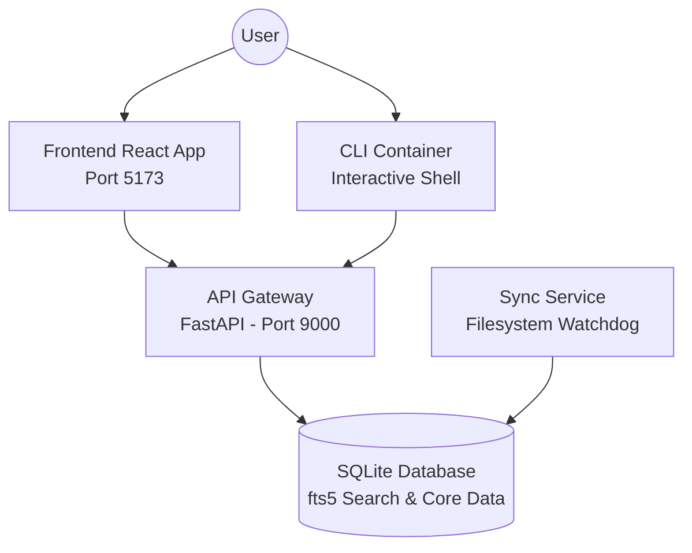

<div align="center">
  <h1>💊 Capsule</h1>
  <p><b>Atomic knowledge management for the AI era.</b></p>
  
  [](https://opensource.org/licenses/MIT)
  [](https://www.docker.com/)
  [](https://fastapi.tiangolo.com/)
  [](https://reactjs.org/)
</div>

---

Capsule is a knowledge system built on a single insight: the unit of knowledge isn't a document — it's a thought. Each `.capsule.md` file is one fact, fully qualified, self-contained, and machine-parseable. No bloated READMEs. No context window waste. Just atoms of truth you can search, compose, and feed to AI agents.

## 🚀 Quick Start (Single-Line Installer)

You can install and boot up the entire Capsule stack (API, Frontend Dashboard, CLI, and Sync Service) with a single command. 

If you have cloned the repository, simply run:
```bash
./install.sh
```

*(If you are hosting this project on GitHub, you can provide users with a remote one-liner like this:)*
```bash
curl -sSL https://raw.githubusercontent.com/your-org/capsule/main/install.sh | bash
```

Once installed, the services will be available at:
- **🌐 Frontend Dashboard:** [http://localhost:5173](http://localhost:5173)
- **🔌 API Gateway:** [http://localhost:9000/api/v1](http://localhost:9000/api/v1)
- **📚 API Docs (Swagger):** [http://localhost:9000/docs](http://localhost:9000/docs)

---

## 🧠 Why Capsule?

Every developer's laptop is a graveyard of `README.md` files that don't talk to each other. Your API docs reference auth patterns in another repo. Your `todo.md` has tasks blocked by decisions in a third. The information exists. It's just trapped in silos.

Capsule breaks knowledge into **atomic units**:
- **One fact per file.**
- **Self-describing metadata** (freshness, confidence, source).
- **Full-text search** across your entire workspace.
- **Context composition** for AI sessions.
- **Cross-project knowledge sharing.**

## 🏗️ Architecture

Capsule uses a robust microservices-oriented architecture powered by Docker Compose:



### Services Overview

| Service | Port | Purpose |
|---------|------|---------|
| **Frontend Web UI** | `5173` | World-class React dashboard with glassmorphism aesthetics. |
| **API Gateway** | `9000` | High-performance REST API handling all knowledge operations. |
| **Sync Service** | `Internal` | Background watchdog that monitors file changes and syncs `.capsule.md` files. |
| **CLI** | `Internal` | Terminal interface for power users. |

## 💻 Interacting with the CLI

The CLI is running inside its own isolated container. You can jump into it at any time to interact with your knowledge base:

```bash
# Attach to the CLI container
docker exec -it capsule-cli /bin/sh

# Inside the container, you can run:
capsule new "Auth middleware bypass in staging" -t auth -t bug -c high
capsule search "JWT"
capsule compose -t auth -t staging
```

## 📄 File Format

Capsules are simply markdown files with YAML frontmatter:

```markdown
---
topic: "Auth middleware bypass in staging"
tags: [bug, auth, staging]
freshness: 2026-07-11T00:00:00+00:00
source: "Claude session #4482"
confidence: high
---

Staging env skips JWT verification when `X-Debug-Override` is present.
This is intentional for E2E tests but never documented.

**Do not remove** — the mobile team relies on it for CI.
```

## 🛠️ Development & Management

If you want to manually manage the stack, you can use the provided scripts:

```bash
# Start all services
./scripts/start_all.sh

# Stop all services gracefully
./scripts/stop_all.sh
```

## 📝 License

Distributed under the MIT License.
