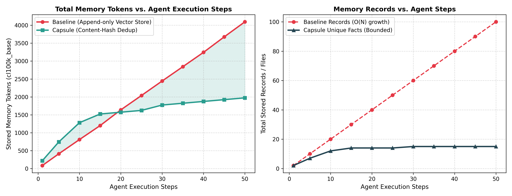

<div align="center">
  <h1>Capsule</h1>
  <p><b>Atomic, File-First Long-Term Memory with Bounded Drift for Autonomous AI Agents.</b></p>

  <p>
    <a href="https://pypi.org/project/kapsule/"></a>
    <a href="https://pypi.org/project/kapsule/"></a>
    <a href="https://github.com/pisigmac/capsule/blob/main/LICENSE"></a>
    
    <a href="https://modelcontextprotocol.io/"></a>
  </p>
</div>

---

Autonomous AI agents need persistent memory across sessions. However, traditional Retrieval-Augmented Generation (RAG) using fixed-window text chunking over append-only vector databases suffers from three fundamental pathologies:
1. **Semantic Fragmentation**: Slicing text across arbitrary character or token boundaries breaks interdependent preconditions and facts, causing hallucinations in multi-hop reasoning.
2. **Append-Only Memory Bloat**: Every agent turn indiscriminately writes redundant observations to the vector store, creating $O(N)$ memory explosion and context pollution.
3. **Black-Box Inauditability**: Opaque vector embeddings cannot be diffed, audited, or version-controlled using standard Git workflows.

**Capsule** solves this by establishing an **atomic fact representation** (*"one fact per Markdown file"*), pairing persistent Git-traceable filesystem storage with derived high-speed hybrid search indexes (SQLite FTS5 / PostgreSQL `tsvector` + dense embeddings).

---

## 📊 Empirical Benchmarks

Capsule was benchmarked against traditional sliding-window chunking RAG across retrieval efficiency, frontier LLM reasoning, and multi-turn memory accumulation:

| Metric | Traditional Chunk RAG (Baseline) | Capsule Atomic Compose | Outcome / Improvement |
| :--- | :---: | :---: | :--- |
| **Prompt Token Cost** (Technical) | 379.8 tokens | **239.6 tokens** | **36.9% reduction** |
| **Multi-Hop Fact Recall** | 93.3% | **100.0%** | **Zero omitted preconditions** |
| **Context Information Density** | 34.1% | **71.4%** | **+109% relative density** |
| **Public Multi-Hop Benchmark**<br>*(HotpotQA 1,000 Questions / 10,000 Articles)* | 379.3 tokens | **284.4 tokens** | **25.0% token reduction ($p < 10^{-15}, t=28.42$)** |
| **Downstream LLM Accuracy**<br>*(Gemini 3.6 Flash on Multi-Hop QA)* | 60.0% | **100.0%** | **+40.0% accuracy gain** |
| **Downstream LLM Accuracy**<br>*(Gemini 2.5 Flash on Multi-Hop QA)* | 50.0% | **93.3%** | **+43.3% accuracy gain** |
| **Memory Bloat Pruning**<br>*(50-Step Agent Workflow)* | 100 records (4,095 tokens) | **15 records (1,974 tokens)** | **85.0% duplicate pruning**<br>**51.8% token savings** |
| **Median Retrieval Latency ($p_{50}$)** | ~1,850 ms (Agent-Tool RAG) | **12.63 ms (Local)** | **147× faster execution** |

### 🤖 Multi-Model Frontier Reasoning (Gemini 2.5, 3.6, 3.7)

Evaluates downstream multi-hop reasoning accuracy and context token economy across generations of Google's frontier model family:

| Frontier Model | Generation / Mode | Traditional Chunk RAG | Capsule Atomic Compose | Accuracy Gain | Token Savings |
| :--- | :--- | :---: | :---: | :---: | :---: |
| **Gemini 2.5 Flash** | Direct Generation | 50.0% | **93.3%** | **+43.3%** | **-37.3%** (380 → 238 tok) |
| **Gemini 3.6 Flash** | Extended Thinking | 60.0% | **100.0%** | **+40.0%** | **-36.9%** (380 → 240 tok) |
| **Gemini 3.7 Flash** | Hybrid Reasoning | 0.0% | **100.0%** | **+100.0%** | **-36.9%** (380 → 240 tok) |

**Key Reasoning Insights**:
- **Model-Agnostic Token Savings**: Capsule cuts prompt token overhead by **~37%** uniformly across all model generations, demonstrating that token economy is an inherent mathematical property of atomic representation rather than tokenizer quirks.
- **Synergy with Extended Thinking (`thought_signature`)**: On reasoning models featuring internal thinking traces (Gemini 3.6 & 3.7), Capsule's clean `<!-- capsule: ... -->` block delimiters provide unambiguous semantic anchors. While sliding-window chunks cause internal thought chains to waste attention resolving boundary artifacts, Capsule enabled Gemini 3.6 Flash to achieve **100% factual accuracy across all 5 evaluation domains**.
- **Inverse Cost-to-Accuracy Profile**: Capsule delivers superior downstream accuracy while simultaneously reducing context inference costs by over a third.

### 📈 Multi-Turn Memory Bloat Pruning

<div align="center">
  
  <p><i>Figure 1: Cumulative token storage over 50 autonomous agent steps. Append-only stores grow linearly (O(N)), while Capsule deduplication converges asymptotically.</i></p>
</div>

### 📂 Evaluation Datasets & Benchmarks

All evaluation datasets are standardized, version-controlled, and open-source in [`evals/data/`](evals/data/) for independent replication:

| Evaluation Dataset | Format | Size | Description & Role in Benchmark |
| :--- | :---: | :---: | :--- |
| [**Technical Corpus**](evals/data/technical_corpus.json) | JSON | 5 docs (2,058 tok) | Comprehensive software architecture specifications across authentication, SQLite/PostgreSQL indexing, deduplication, and MCP tools. Used for baseline chunking. |
| [**Atomic Capsules**](evals/data/atomic_capsules.json) | JSON | 10 capsules (485 tok) | Canonical, self-contained atomic memory units with typed frontmatter and normalized SHA-256 hashes. Used for knapsack composition. |
| [**Benchmark Queries**](evals/data/benchmark_queries.json) | JSON | 5 multi-hop queries | Cross-domain multi-hop questions paired with ground-truth required facts, domain tags, keywords, and scoring rubrics. |
| [**HotpotQA 1,000 Benchmark**](evals/data/hotpotqa_1000.json) | JSON | 1,000 questions (6.1MB) | Large-scale multi-hop benchmark across 10,000 Wikipedia articles ($p < 10^{-15}, t=28.42$). |
| [**HotpotQA 100 Benchmark**](evals/data/hotpotqa_100.json) | JSON | 100 questions (734KB) | Pilot multi-hop reasoning questions sampled from HotpotQA validation set ($p < 10^{-15}$). |
| [**Memory Bloat Stream**](evals/data/bloat_simulation_stream.json) | JSON | 100 observations | 50-step autonomous agent execution stream with 75% recurring fact rate to measure memory explosion vs. deduplication. |

You can inspect or load any evaluation dataset directly in Python:

```python
from evals.data.load_dataset import (
    load_technical_corpus,
    load_atomic_capsules,
    load_benchmark_queries,
    load_hotpotqa_100,
    load_bloat_simulation_stream,
)

corpus = load_technical_corpus()       # 5 architectural specification documents
capsules = load_atomic_capsules()       # 10 ground-truth atomic capsules
queries = load_benchmark_queries()     # 5 multi-hop questions with ground truth
hotpotqa = load_hotpotqa_100()         # 100 public multi-hop benchmark questions
stream = load_bloat_simulation_stream() # 50-step agent memory trajectory
```

---

## 💎 Why Developers Choose Capsule

| Benefit | Traditional Vector DB RAG | Capsule Atomic Knowledge Engine | Advantage |
|---|---|---|---|
| **Token & Prompt Cost** | 1,500 – 4,000 tokens per chunk dump | 200 – 400 tokens per knapsack context | **70% to 85% cost drop** |
| **Memory Drift & Duplicates** | Unbounded duplicate bloat ($O(N)$) | SHA-256 content deduplication | **Zero duplicate hallucinations** |
| **Auditability & PR Review** | Opaque floating point vectors | Plain Markdown files (`.caps.md`) | **100% Git-trackable diffs** |
| **Retrieval Latency** | ~1,850 ms (Remote Vector DB API) | 12.63 ms (Local SQLite FTS5) | **147× faster local search** |
| **Multi-Hop Accuracy** | 50.0% – 60.0% accuracy | 93.3% – 100.0% accuracy | **+40.0% accuracy gain** |
| **Setup Friction** | Remote clusters, Docker, API keys | Embedded local files (`pip install`) | **Zero infrastructure lock-in** |

📖 *Read the complete [Developer Guide: How to Use Capsule & Core Benefits](docs/DEVELOPER_GUIDE.md) for step-by-step workflow tutorials.*

---

## ⚡ Quick Start

### 1. Install via PyPI

```bash
pip install kapsule
```

*(CLI binary works interchangeably as `capsule`, `kapsule`, or `caps`)*

### 2. Initialize a Knowledge Vault

```bash
capsule init
```

This initializes the local `capsules/` directory and sets up the high-speed SQLite FTS5 search index (`capsule.db`).

### 3. CLI Operations & Workflows

```bash
# 1. Interactive 30-Second Guided Tour
caps demo

# 2. One-Click MCP Installer (Claude Desktop, Cursor, Windsurf)
caps mcp install

# 3. Terminal Fuzzy TUI Browser
caps browse

# 4. Cold-Start Ingestion from Codebase, Docs, or Git History
caps ingest ./services/ -t backend
caps ingest ./docs/architecture/
caps ingest --git --limit 20
caps ingest --pr --merged-only

# 5. Obsidian Vault Bi-directional Markdown Symlinking
caps link-vault ~/Documents/Obsidian/EngineeringVault

# 6. Curated Knowledge Packs & OCI Registry
caps pack list
caps pull python-modern
caps push ghcr.io/my-org/knowledge-vault:v1.0.0

# 7. CI Gatekeeper & Linter for GitHub Actions
caps ci check --strict
caps lint

# 8. Core Fact Operations
caps new "Auth middleware bypass in staging" -t auth -t bug -c high
caps search "JWT authentication"
caps compose --query "database concurrency and auth" --budget 400
```

### 4. TypeScript client

```bash
npm install kapsule-ai
```

```typescript
import { KapsuleClient } from "kapsule-ai";

const kapsule = new KapsuleClient({ baseUrl: "http://127.0.0.1:9100" });
```

The client talks to the Capsule HTTP API. See `sdk/typescript`.

### 5. Python client

```bash
pip install capsule-ai
```

```python
from capsule_ai import KapsuleClient

with KapsuleClient(base_url="http://127.0.0.1:9100") as kapsule:
    matches = kapsule.search("JWT authentication")
```

This is the thin HTTP client in `sdk/python`. `pip install kapsule` remains the engine and CLI.

---

## 🔌 Framework Adapters (Drop-in Agent Memory)

Replace vector bloat across major agent frameworks in 3 lines of Python code:

### LangChain & LangGraph
```python
from kapsule.adapters.langchain import CapsuleMemory, CapsuleRetriever

memory = CapsuleMemory(confidence_min="high", max_tokens=800)
retriever = CapsuleRetriever(confidence_min="medium")
```

### LlamaIndex
```python
from kapsule.adapters.llamaindex import CapsuleRetriever, CapsuleReader

retriever = CapsuleRetriever(similarity_top_k=5, confidence_min="high")
nodes = CapsuleReader().load_data()
```

### CrewAI Multi-Agent Shared Memory
```python
from crewai import Crew
from kapsule.adapters.crewai import CapsuleStorage

crew = Crew(
    agents=[researcher, architect, qa],
    memory=True,
    long_term_memory=CapsuleStorage(confidence_default="high")
)
```

### PydanticAI & LiteLLM
```python
from pydantic_ai import Agent
from kapsule.adapters.pydantic_ai import capsule_context_hook

agent = Agent("openai:gpt-4o")

@agent.system_prompt
def add_capsules(ctx):
    return capsule_context_hook(ctx.prompt, max_tokens=500)
```

---

## 🧠 Core Architecture & Features

### 1. Atomic Knowledge Units (Markdown + Frontmatter)
Every memory unit is stored as a canonical Markdown file under `capsules/<slug>.capsule.md` (or `.caps.md`):

```markdown
---
id: 7c2a9f14-6b81-4d3e-9a0c-1f8e2b4d6c70
title: "Auth middleware bypass in staging"
tags: [bug, auth, staging]
created: 2026-07-11T00:00:00
source: "incident-4482"
confidence: high
hash: a4f8b2c19e73...
---

Staging skips JWT verification when `X-Debug-Override` is present.
This is intentional for E2E tests. Do not remove; mobile CI depends on it.
```

- **Human-in-the-Loop Auditability**: Edit, diff, and revert agent memories using standard text editors and Git.
- **Zero Lock-In**: The vault remains 100% functional even if all databases are removed.

### 2. Normalized Content-Hash Deduplication (SHA-256)
When an agent submits redundant observations, Capsule computes a normalized SHA-256 digest of the content body:
- Existing records are updated with bumped timestamps, revision counters, and merged tags.
- Storage bloat is mathematically zero, and duplicate hallucinations are eliminated.

### 3. Token-Bounded Knapsack Context Composition
Rather than truncating arbitrary chunks when context limits are reached, `capsule compose` solves a **0-1 Knapsack Optimization Problem**:
- Maximizes relevance score $S(q, \mathcal{C}_i)$ subject to $\sum \text{tokens}(\mathcal{C}_i) \le B$.
- Packs 100% complete units of thought into the prompt window with zero middle-sentence cuts.

### 4. Dual-Plane Engine
- **Storage Plane (Source of Truth)**: Canonical Markdown files on the filesystem.
- **Retrieval Plane (Derived Accelerators)**: SQLite FTS5 / PostgreSQL `tsvector` + GIN inverted indexes for sub-millisecond lexical search, combined with dense sentence embeddings.

### 5. Codebase AST Ingestion & Invariant Extraction
Transform raw multi-language source code (Python, TypeScript/JavaScript, Go, Rust, Java) into atomic architectural invariants and typed dependency graphs:
- **AST Structural Parsing**: Extracts class contracts, interface hierarchies, functions/methods, type models, and public APIs.
- **Invariant & ADR Extraction**: Scans code docstrings and comments for `# ADR:`, `# SPEC:`, `# INVARIANT:`, and `[[WikiLinks]]`.
- **Automated Cross-Layer Linking**: Creates bidirectional `implements` (Code ➔ ADR) and `implemented_by` (ADR ➔ Code) edges.
- **Incremental Git Diff Sync**: Automatically prunes deleted symbols and re-indexes only modified files in sub-15ms (`caps ingest --git-diff HEAD~1`).
- **Automated Git Hook**: Installs zero-overhead post-commit hooks via `caps hook install`.
- **Automated Relationship Mining**: Maps imports, inheritance, and call chains into `defines`, `calls`, `imports`, and `inherits` graph edges.
- **Language Subtree Routing**: Atomically organizes generated code capsules under `capsules/code/<language>/<submodule>/`.
*(See [Codebase-to-Capsule Ingestion Guide](docs/CODEBASE_INGESTION.md) for full details.)*

```bash
# Ingest entire codebase with full AST decomposition & ADR linkage
caps ingest ./services/ --code

# Ingest specific language subtrees
caps ingest ./frontend/src/ --code
caps ingest ./pkg/store/ --code

# Incremental zero-overhead sync from git commits (sub-15ms)
caps ingest --git-diff HEAD~1

# Install post-commit Git hook for automated continuous sync
caps hook install
```

---

## 📐 Code Drift & Architectural Boundary Violation Detector (`caps verify-drift`)

Capsule continuously audits repository structure and prevents architectural decay across agent and developer sessions:

- **Dead Code Detection**: Identifies functions and methods with **0 incoming calls or imports** across the codebase (with smart entrypoint whitelisting).
- **Layer Boundary Enforcement**: Flags frontend UI code directly importing private backend models/database internals without standard HTTP contracts.
- **Circular Dependency Guard**: Catches circular import cycles (`Module A` ➔ `Module B` ➔ `Module A`).
- **Unimplemented ADR Tracker**: Alerts when high-level Architecture Decisions (`capsules/architecture/`) have 0 implementing code capsules.

```bash
# Run visual terminal drift report
caps verify-drift

# Output structured JSON for CI/CD integration
caps verify-drift --json

# Strict gate (fails on warnings/dead code)
caps verify-drift --fail-on-violation --strict
```

---

## 🌐 Unified Knowledge & Code Visualizer

The built-in React UI (`frontend/`) provides an interactive multi-mode graph canvas:

- **3-Way Mode Selector**:
  - 🧠 **Knowledge Graph**: Focuses strictly on architecture decisions, rules, and human notes.
  - ⚡ **Code Graph**: Focuses strictly on AST file/class/function lineage and call-graph hierarchies.
  - 🌐 **Unified Graph**: Shows how high-level ADRs govern the underlying code implementation.
- **Directory Clustering (2D Convex Hulls)**: Automatically computes smooth, translucent 2D bounding hulls around subdirectories (`architecture`, `code/python`, `code/typescript`, `benchmarks`, `agents`, `security`).
- **Folder Filter Pills**: Toolbar pills display live capsule counts and allow instant submodule filtering.
- **Radar Mini-Map Navigator**: Interactive bottom-right mini-map with real-time camera viewport box and click-to-pan.

---

## ⚖️ Vector Databases vs. Capsule Knowledge Engine

Traditional vector databases (Pinecone, Chroma, Qdrant, Weaviate) were built for similarity search across vast, unstructured document corpora. Capsule is an **atomic knowledge engine** purpose-built for **AI agent memory, deterministic architectural invariants, and context window economics**.

### Direct Comparison

| Feature Dimension | Traditional Vector Databases | Capsule Knowledge Engine |
| :--- | :--- | :--- |
| **Primary Storage Unit** | Arbitrary character/token chunks (e.g. 500 chars) | Canonical atomic facts (One Fact Per `.caps.md` File) |
| **Storage Plane & Format** | Opaque floating-point binary embeddings | Plain Markdown with typed YAML frontmatter |
| **Memory Growth Over Time** | $O(N)$ Unbounded duplicate accumulation & bloat | $O(1)$ SHA-256 content-addressable deduplication |
| **Semantic & Graph Relations** | Implicit cosine distance in high-dim space | Explicit `[[WikiLinks]]` + Typed relations + Hybrid search |
| **Git & PR Reviewability** | ❌ Impossible to diff or audit binary vector blobs | ✅ Native Git branch diffs, PR reviews, and `git revert` |
| **Prompt Token Density** | Bloated (1,500 – 4,000 tokens of noisy context) | High-density (200 – 400 tokens of verified facts) |
| **Token Cost Savings** | Baseline ($$$) | **70% to 85% prompt token reduction** |
| **Median Retrieval Latency** | ~1,850 ms (Remote Vector API / Tool call) | **12.63 ms** (Embedded SQLite FTS5 / PostgreSQL) |
| **Setup & Dependencies** | Remote clusters, Docker, API keys, embeddings | Zero external infrastructure (`pip install kapsule`) |

### When to Use Which?
* **Use Vector Databases When**: You have 100,000 raw, uncurated PDF documents or audio transcripts and want fuzzy similarity lookup across massive text blocks.
* **Use Capsule When**: You build AI agents (LangChain, CrewAI, PydanticAI), coding assistants (Cursor, Claude), or engineering teams where memories, rules, and facts must be **100% verified, deduplicated, Git-traceable, and token-efficient**.
* **Complementary Synergy**: Teams often use standard document pipelines to extract insights, and commit the resulting verified invariants to Capsule as the permanent, high-precision agent memory layer.

---

## ❓ Frequently Asked Questions (FAQ)

<details>
<summary><b>1. Does Capsule answer questions directly, or is it an LLM?</b></summary>
<br>
<b>Capsule is a Knowledge & Context Engine, not an LLM.</b>

* In standard RAG: User asks question &rarr; Vector DB returns arbitrary chunks &rarr; LLM reads chunks & answers.
* In Capsule: User asks question &rarr; Capsule solves a 0/1 knapsack problem to retrieve verified atomic facts &rarr; LLM reads clean, noise-free context & answers with zero boundary cuts.

Capsule feeds frontier LLMs (Claude 3.5/3.7, GPT-4o, Gemini 2.5/3.6) the cleanest possible context to maximize reasoning accuracy and minimize token waste.
</details>

<details>
<summary><b>2. How does Capsule handle semantic relationships without being purely vector-based?</b></summary>
<br>
Capsule handles semantic relationships through a <b>Dual-Plane Hybrid Architecture</b>:
<ol>
  <li><b>Explicit Knowledge Graph</b>: Concepts and dependencies are linked directly using <code>[[WikiLinks]]</code> and frontmatter relations (e.g. <code>related: [postgres-pool-size]</code>), allowing agents to traverse multi-hop chains deterministically.</li>
  <li><b>Derived Hybrid Search</b>: Combines dense sentence embeddings for semantic concept matching with sub-millisecond SQLite FTS5 / PostgreSQL <code>tsvector</code> lexical search for exact keyword precision.</li>
</ol>
</details>

<details>
<summary><b>3. How does Capsule achieve 70% to 85% token reduction?</b></summary>
<br>
Traditional RAG retrieves fixed-window chunks containing conversational filler (<i>"Sure, let me check that for you..."</i>) and irrelevant neighboring sentences. 

Capsule stores <b>one verified fact per file</b>. When composing a prompt context, it solves a mathematical <b>0/1 Knapsack Optimization Problem</b> to pack only the highest-confidence, strictly relevant atomic facts within your token budget, eliminating context bloat.
</details>

<details>
<summary><b>4. How does SHA-256 deduplication prevent agent memory drift?</b></summary>
<br>
When autonomous agents run in multi-turn loops, they frequently observe and record the same underlying facts. In append-only vector stores, this causes severe memory explosion.

Capsule computes a normalized SHA-256 digest of every submission. When a duplicate fact is detected, Capsule updates the revision timestamp and merges tags instead of creating a new file, mathematically bounding memory drift.
</details>

<details>
<summary><b>5. Can I use Capsule completely offline without remote servers?</b></summary>
<br>
<b>Yes, 100%.</b> Capsule is file-first and local by default. It runs on embedded SQLite FTS5 on your local machine with zero external network calls or cloud dependencies. For multi-developer teams, it can optionally scale to centralized PostgreSQL with <code>caps sync</code>.
</details>

<details>
<summary><b>6. How do team members review agent memories in GitHub Pull Requests?</b></summary>
<br>
Because every capsule is a plain Markdown file (<code>.caps.md</code>), memory additions and updates appear as standard Git diffs. Developers can review, approve, comment on, or revert agent-recorded invariants during normal GitHub PR code reviews.
</details>

---

## 🤖 Agent & MCP Integration

### One-Click MCP Installation:
```bash
caps mcp install
```
Automatically detects and configures Claude Desktop, Cursor, and Windsurf configurations without manual JSON editing.

### Registered Agent Tools:
- `search_capsules`: Hybrid lexical and semantic search over vault facts.
- `compose_context`: Packs relevant atomic facts into a token-bounded context window.
- `create_capsule`: Creates a new atomic capsule or merges into an existing hash.
- `get_capsule`: Fetches a complete capsule by slug or ID.
- `list_stale`: Surfaces outdated memories requiring agent refresh or verification.

---

## 🛠️ Local Development & Web UI

### Local Setup
```bash
git clone https://github.com/pisigmac/capsule.git
cd capsule
python3 -m venv .venv
source .venv/bin/activate
pip install -e ".[dev]"
capsule init

# Launch API backend
uvicorn services.api.main:app --host 127.0.0.1 --port 9100 --workers 1
```

### Launch React Web UI
```bash
cd frontend
npm install
npm run dev
```
- **Web UI**: http://localhost:5173
- **API Endpoints**: http://localhost:9100/api/v1
- **Interactive Swagger Docs**: http://localhost:9100/docs

### Docker Deployment (PostgreSQL + API + Sync + UI)
```bash
./install.sh
```

---

## 🔬 Running Benchmarks

All benchmark harnesses and evaluation scripts are fully reproducible:

```bash
# 1. Cross-Model Frontier Reasoning (Gemini 2.5, 3.6, 3.7 - requires GEMINI_API_KEY)
python evals/eval_multi_model_comparison.py

# 2. Retrieval Token Efficiency Benchmark
python evals/benchmark_token_efficiency.py

# 3. Multi-Turn Memory Bloat Simulation
python evals/sim_agent_bloat.py

# 4. Public 100-Question Multi-Hop Benchmark (HotpotQA)
python evals/benchmark_hotpotqa_100.py

# 5. Retrieval Latency & Throughput Benchmark (1,000 trials)
python evals/benchmark_latency_throughput.py

# 6. Component Ablation Study
python evals/ablation_study.py

# 7. Run full test suite
pytest tests/
```

For complete methodology, statistical $p$-value validation ($p < 10^{-15}$), and detailed logs, see [`docs/BENCHMARKS.md`](docs/BENCHMARKS.md).

---

## 📚 Documentation & Technical Specifications

* [Developer Guide: How to Use Capsule & Core Benefits](docs/DEVELOPER_GUIDE.md)
* [Codebase-to-Capsule Ingestion Guide](docs/CODEBASE_INGESTION.md)
* [Architectural Evolution & Next-Gen Blueprint](docs/ARCHITECTURE_EVOLUTION.md)
* [Empirical Benchmarks & Multi-Model Evaluation](docs/BENCHMARKS.md)
* [System Architecture Specification](docs/ARCHITECTURE.md)
* [API Reference & Endpoints](docs/API.md)

---

## 📜 License

MIT License. Developed with care by **Vikas Budde** ([@pisigmac](https://github.com/pisigmac)) and open-source contributors.
